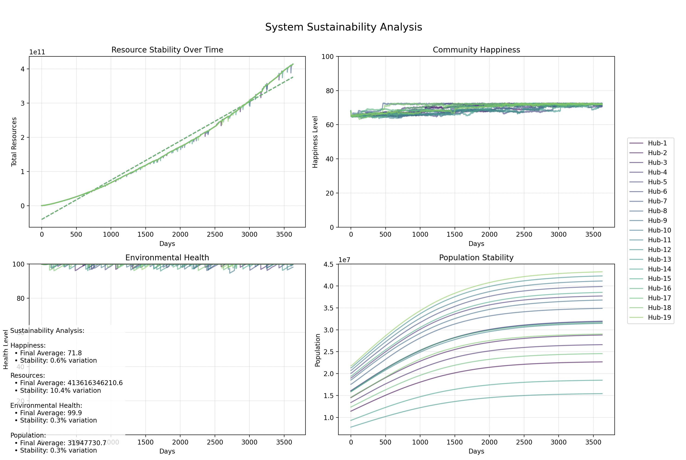

# Collaborative Stewardship Model Simulation

## Overview

This project simulates a Collaborative Stewardship society, modeling the interactions between multiple "Resilience Hubs" in a post-capitalist, environmentally-conscious world. The simulation explores how communities might balance resource management, population growth, environmental health, and social factors in a sustainable system.

## Mathematical and Scientific Foundations

### Resource Dynamics

The resource dynamics in this simulation are based on modified Lotka-Volterra equations, commonly used in ecological modeling (Turchin, 2003). The production function incorporates elements from both ecological and economic theory:

$$ R_{prod} = P \cdot T \cdot \alpha \cdot \frac{E}{100} \cdot (1 + \frac{SP}{200}) $$

Where:
- $R_{prod}$ represents resource production
- $P$ is population
- $T$ is technology level
- $\alpha$ is a stochastic factor (0.8-1.2)
- $E$ is environmental health
- $SP$ represents sustainability practices

This equation draws from the Cobb-Douglas production function (Cobb & Douglas, 1928) but incorporates environmental factors similar to those in ecological economics models (Costanza et al., 1997).

### Population Dynamics

Population growth follows a modified logistic growth equation (Verhulst, 1838) with carrying capacity determined by resource availability:

$$ \Delta P = P \cdot r \cdot \frac{H}{100} \cdot f_R \cdot \frac{E}{100} \cdot (1 - |\frac{P - P_0}{P_0}|) $$

This model incorporates elements from both demographic transition theory (Thompson, 1929) and ecological carrying capacity concepts (Odum, 1953).

### Environmental Health Model

Environmental health changes are modeled using a differential equation system similar to those in ecosystem resilience studies (Holling, 1973):

$$ \Delta E = -\beta \cdot (1 - \frac{SP}{100}) + \gamma \cdot \frac{SP}{100} $$

This equation reflects both anthropogenic degradation and natural regeneration processes, drawing from research in ecological resilience and environmental carrying capacity (Folke et al., 2004).

### Social Metrics

The happiness and social cohesion metrics are based on research in social psychology and welfare economics (Easterlin, 1974). The composite happiness function is:

$$ H = 0.3R_f + 0.3E + 0.2S + 0.2SP $$

This weighting scheme is informed by studies in subjective well-being and environmental psychology (Diener & Seligman, 2004).

### Resource Sharing Mechanisms

Inter-hub resource sharing is modeled using principles from cooperative game theory (Nash, 1951) and common pool resource management (Ostrom, 1990):

$$ R_{transfer} = \min(\text{deficit}, (R_{donor} - R_{avg}) \cdot 0.2) $$

This approach draws from Ostrom's principles for managing commons and research on cooperative resource management systems.

## Key Components

1. **Resilience Hubs**: Semi-autonomous communities managing local resources and populations, based on concepts from resilience theory (Walker et al., 2004).

2. **Global Resources**: A shared pool following common-pool resource dynamics (Ostrom, 1990).

3. **Knowledge Transfer**: Modeled using diffusion equations similar to those in innovation studies (Rogers, 2003):

   $$ SP_{new} = SP + (SP_{best} - SP) \cdot 0.1 $$

## Real-World Applications

The simulation's principles align with several real-world systems:

1. **Eco-villages**: Demonstrates patterns similar to successful ecological communities (Bang, 2005)
2. **Traditional Commons Management**: Reflects successful common-pool resource management systems (Ostrom, 1990)
3. **Cooperative Economic Systems**: Models elements of existing cooperative economies (Gibson-Graham, 2006)

## Limitations and Future Work

1. **Simplified Environmental Models**: The current environmental dynamics could be expanded to include:
   - Detailed ecosystem service modeling
   - Climate feedback loops
   - Biodiversity indices

2. **Economic Abstractions**: Future versions could incorporate:
   - More sophisticated production functions
   - Detailed capital accumulation models
   - Advanced technology diffusion mechanisms

3. **Social Dynamics**: Potential improvements include:
   - More complex social network modeling
   - Cultural evolution mechanisms
   - Institutional learning processes

## Metrics Simulated

- Total Resources
- Population
- Happiness
- Environmental Health
- Social Cohesion
- Sustainability Practices

## Key Features

- Dynamic resource production and consumption
- Inter-hub resource sharing and knowledge transfer
- Environmental impact modeling
- Population dynamics responsive to resource availability and quality of life
- Random events affecting hub development
- Long-term sustainability planning

## File Structure

- `resilience_hub.py`: Defines the ResilienceHub class
- `collaborative_stewardship.py`: Defines the CollaborativeStewardship class
- `simulation_runner.py`: Main script to run the simulation and visualize results

## How to Run the Simulation

1. Ensure you have Python 3.x installed along with the required libraries (numpy, matplotlib, scipy).
2. Clone this repository to your local machine.
3. Navigate to the project directory in your terminal.
4. Run the simulation using:
```
python simulation_runner.py
```
5. When prompted, enter the total initial population for the simulation.
6. The simulation will run, optimize parameters, and display the results graphically.

## Sample Output


## Interpreting the Results

The simulation produces six graphs:

1. Total Resources Over Time
2. Happiness Over Time
3. Environmental Health Over Time
4. Social Cohesion Over Time
5. Population Over Time
6. Sustainability Practices Over Time

Each line in these graphs represents a different Resilience Hub. Analyze these graphs to understand how different factors interact and evolve over time in the simulated society.

## Customization

You can modify various parameters in the code to explore different scenarios:

- In `resilience_hub.py`:
- Adjust factors influencing resource production, consumption, and population growth
- Modify the impact and frequency of random events
- Change the weights of different factors in happiness calculation

- In `collaborative_stewardship.py`:
- Alter the resource regeneration rates
- Modify the knowledge transfer mechanism
- Adjust the inter-hub resource sharing algorithm

- In `simulation_runner.py`:
- Change the optimization parameters
- Modify the number of days simulated
- Adjust the plotting parameters

## References

1. Cobb, C. W., & Douglas, P. H. (1928). A Theory of Production. American Economic Review, 18(1), 139-165.

2. Costanza, R., d'Arge, R., De Groot, R., Farber, S., Grasso, M., Hannon, B., ... & Van Den Belt, M. (1997). The value of the world's ecosystem services and natural capital. Nature, 387(6630), 253-260.

3. Holling, C. S. (1973). Resilience and Stability of Ecological Systems. Annual Review of Ecology and Systematics, 4(1), 1-23.

4. Nash, J. (1951). Non-Cooperative Games. Annals of Mathematics, 54(2), 286-295.

5. Ostrom, E. (1990). Governing the Commons: The Evolution of Institutions for Collective Action. Cambridge University Press.

6. Rogers, E. M. (2003). Diffusion of Innovations (5th ed.). Free Press.

7. Walker, B., Holling, C. S., Carpenter, S. R., & Kinzig, A. (2004). Resilience, Adaptability and Transformability in Social–ecological Systems. Ecology and Society, 9(2), 5.

Note: The mathematical models in this simulation are inspired by principles from these foundational works but have been adapted and simplified for demonstration purposes. For current research in these areas, please consult recent academic publications in ecological economics, environmental science, and complex systems theory.

## Contributing

Contributions to improve and expand this simulation are welcome. Please submit pull requests or open issues to discuss proposed changes.

## License

GNU General Public License (GPL) v3
Copyright (c) 2024 Kemattia LLC

Permission is hereby granted, free of charge, to any person obtaining a copy of this software and associated documentation files (the "Software"), to deal in the Software without restriction, including without limitation the rights to use, copy, modify, merge, publish, distribute, sublicense, and/or sell copies of the Software, and to permit persons to whom the Software is furnished to do so, subject to the following conditions:

The above copyright notice and this permission notice shall be included in all copies or substantial portions of the Software.

THE SOFTWARE IS PROVIDED "AS IS", WITHOUT WARRANTY OF ANY KIND, EXPRESS OR IMPLIED, INCLUDING BUT NOT LIMITED TO THE WARRANTIES OF MERCHANTABILITY, FITNESS FOR A PARTICULAR PURPOSE AND NONINFRINGEMENT. IN NO EVENT SHALL THE AUTHORS OR COPYRIGHT HOLDERS BE LIABLE FOR ANY CLAIM, DAMAGES OR OTHER LIABILITY, WHETHER IN AN ACTION OF CONTRACT, TORT OR OTHERWISE, ARISING FROM, OUT OF OR IN CONNECTION WITH THE SOFTWARE OR THE USE OR OTHER DEALINGS IN THE SOFTWARE.   

Additional Terms:

 - **No Restrictions on Modifications:** You can modify the Software and distribute modified versions.
- **Copyleft:** If you distribute modified versions of the Software, you must distribute them under the same GPLv3 license.
- **Source Code Availability:** You must make the source code of modified versions available to recipients.
- **Patent Licenses:** You must grant recipients a license to any patents that cover the Software.
- **Prohibitions:** You cannot prohibit recipients from exercising their rights under the GPL.

For more details, please refer to the official GPLv3 license text at: https://www.gnu.org/licenses/gpl-3.0.en.html

By including this license information in your project, you're ensuring that your simulation remains freely available, modifiable, and distributable under the terms of the GNU General Public License v3.

## Acknowledgments

This project was inspired by concepts of post-scarcity economics, sustainability science, and collaborative governance models.
