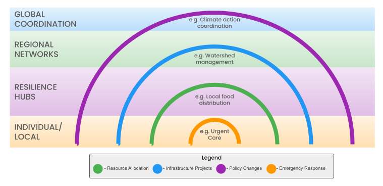
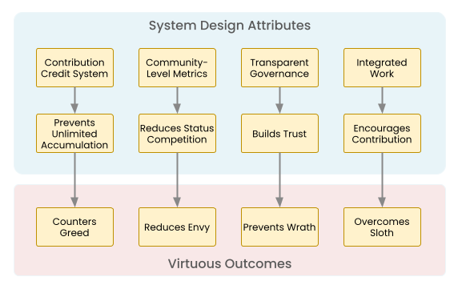
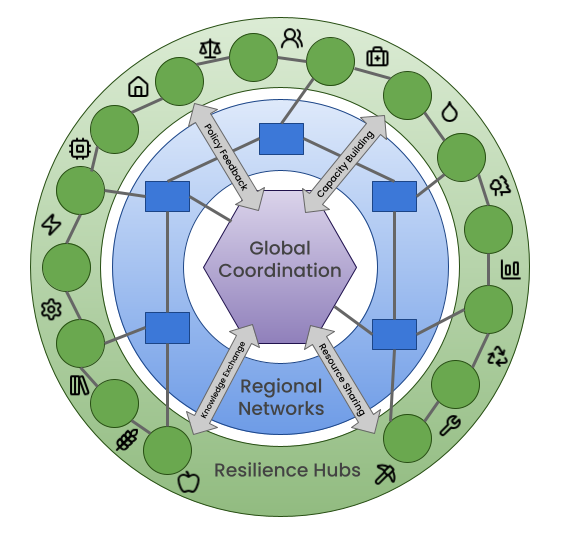
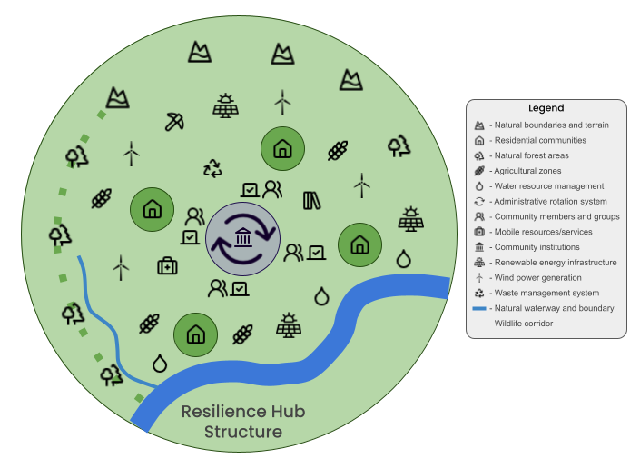
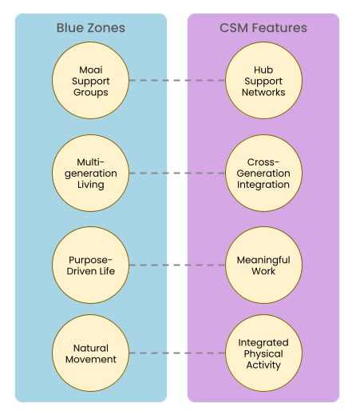
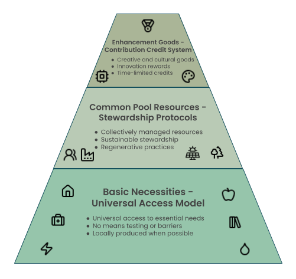
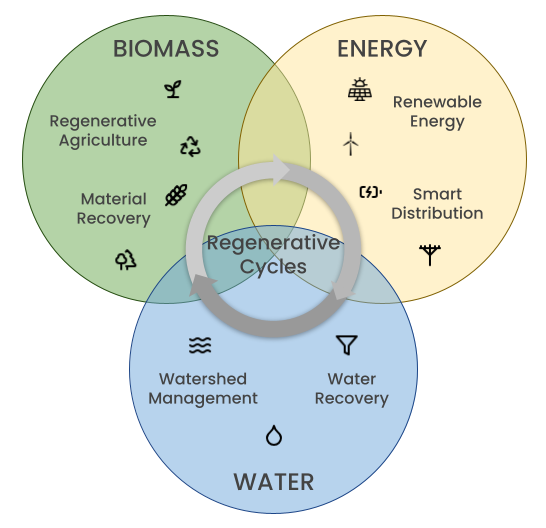
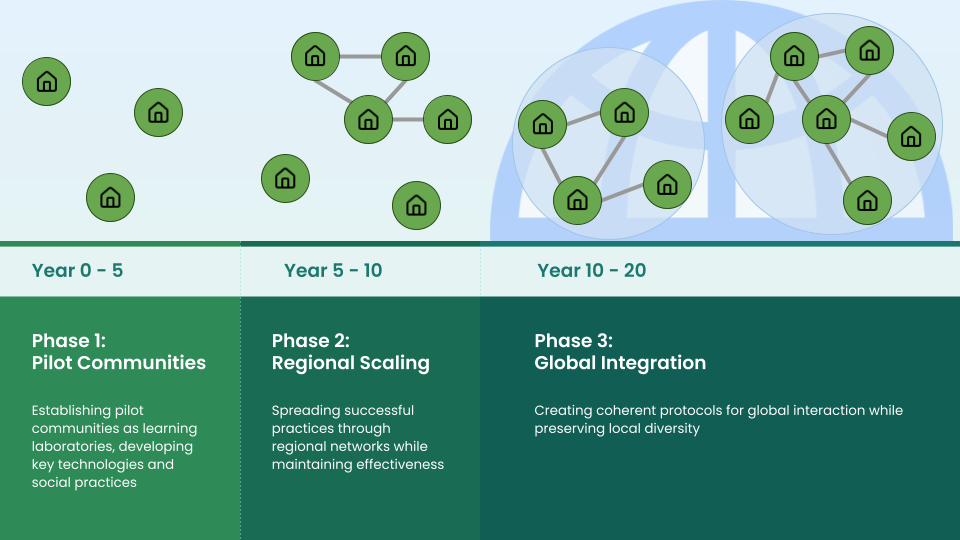
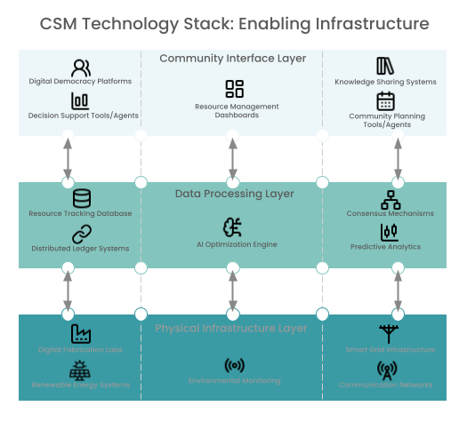
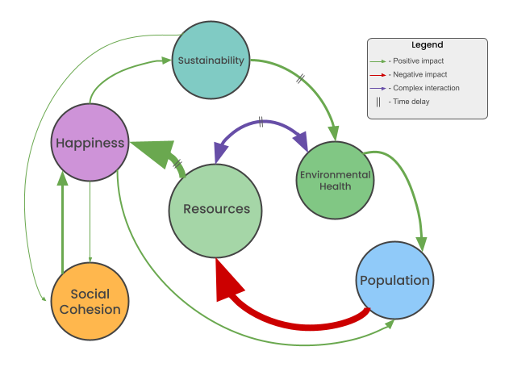

# A Blueprint for Collaborative Stewardship: A Post-Scarcity Societal Model

***
Dan Broadway
Kemattia LLC
December 2024
***

## Abstract

This whitepaper presents a comprehensive framework for a society built on collaborative stewardship, drawing inspiration from successful examples like the Mondragón Cooperative Corporation, the Kerala participatory planning system, and Nordic social democracy, while advancing beyond their limitations through new technological capabilities and ecological design principles. Our model integrates insights from complex systems theory, ecological economics, and social psychology to address contemporary challenges of resource distribution, environmental degradation, and social inequality. Drawing from successful examples of commons-based resource management and recent advances in distributed systems technology, we propose a practical pathway toward a more equitable and sustainable future.

## 1\. Introduction

The early 21st century has brought humanity face-to-face with multiple intersecting crises: accelerating climate change, widening wealth inequality, and the rapid depletion of natural resources. Current economic models have proven inadequate to address these challenges. The pursuit of infinite growth collides with planetary boundaries, while centralized control structures struggle with innovation and responsiveness to local needs.

The Collaborative Stewardship Model (CSM) offers a different path. Building on Ostrom's work on commons governance (Ostrom, 1990\) and recent advances in distributed systems technology (Davidson et al., 2016), CSM presents a framework where communities directly manage resources through nested networks of autonomous but interconnected hubs. This approach combines the dynamism and innovation of distributed systems with the equity and sustainability focus of commons-based governance.

Recent successful experiments with similar approaches \- from the Mondragón Cooperative Corporation in Spain to the Kerala Model in India \- demonstrate the viability of alternative economic structures (Gibson-Graham, 2013). These real-world examples inform our framework while addressing their limitations through contemporary technological capabilities and ecological design principles.

## 2\. Core Principles

### 2.1 Decentralized Autonomy

The foundation of CSM rests on networks of semi-autonomous Resilience Hubs. Unlike the rigid hierarchies of traditional governance systems, these hubs operate through dynamic, overlapping spheres of influence. 

|  |
|:--:|
| *Figure 1: Scales of Coordination in the CSM. The system handles most decisions at the lowest effective level, with broader coordination required only for issues affecting larger geographic areas or requiring system-wide alignment. Examples show characteristic activities at each scale, from local urgent care to global climate initiatives.* |

Each hub maintains significant autonomy in local decision-making while participating in larger coordinating structures for issues that transcend local boundaries.

Research in complex adaptive systems demonstrates that such distributed networks often outperform centralized systems in resilience and adaptability (Meadows, 2008). When one component faces challenges, the network can quickly reorganize to maintain essential functions. This principle appears throughout nature, from neural networks to mycorrhizal fungi, and provides a time-tested template for human organization.

The hub structure allows for cultural and methodological diversity, enabling communities to adapt practices to local conditions while maintaining coherent coordination at larger scales. This addresses a key weakness of previous alternative economic models: the tension between local autonomy and larger-scale coordination.

### 2.2 Resource Stewardship

The model reimagines humanity's relationship with natural resources. Rather than treating resources as commodities to be owned and exploited, CSM implements a stewardship approach grounded in indigenous wisdom and modern ecological science. Resources are held in trust for current and future generations, with access governed by sustainable use rather than accumulation.

Studies of traditional commons management systems show that communities can effectively govern shared resources when proper institutional arrangements exist (Ostrom, 2015). The CSM builds on these insights while incorporating modern monitoring technologies and scientific understanding of ecological systems.

### 2.3 Collaborative Economics

The CSM introduces a novel economic architecture built on collaborative principles. Drawing from emerging patterns of peer-to-peer production and commons-based resource management, this approach enables effective resource distribution while fostering innovation and community engagement. This approach has already demonstrated remarkable success in areas like open-source software development, where complex products emerge through voluntary cooperation rather than hierarchical control (Weber, 2004).

The system distinguishes between different types of goods and services, applying varied distribution mechanisms based on their characteristics. Basic necessities follow a universal access model, while discretionary resources operate through contribution-based systems. This hybrid approach maintains incentives for innovation while ensuring fundamental human needs are met.

Modern technologies enable unprecedented coordination capabilities. Distributed ledger systems provide transparency and accountability, while AI-driven optimization tools help match resources to needs efficiently. These technologies don't determine the system's structure but rather facilitate human-scale cooperation at previously impossible scales.

### 2.4 Moral Foundations

The effectiveness of any social system ultimately rests not just on its structures and processes, but on its alignment with fundamental human values. Throughout history, societies have grappled with the corrupting influences of excessive wealth and power. The ancient Greeks warned of pleonexia - the insatiable desire for more - while Buddhist teachings caution against tanha, or craving. These warnings find modern expression in the devastating impacts of unchecked consumption and accumulation on both human wellbeing and ecological systems.

The Collaborative Stewardship Model addresses these age-old challenges not through moral pronouncements or coercive control, but through thoughtful system design that naturally encourages virtuous behavior. This approach draws inspiration from diverse spiritual and philosophical traditions while remaining firmly grounded in contemporary understanding of human psychology and social dynamics.

|  |
|:--:|
| *Figure X: System Design Elements and Their Influence on Virtuous Behavior. The CSM's structural elements (top) naturally promote virtuous outcomes (bottom) through inherent system design rather than external enforcement.* |

Consider how virtually every major philosophical and religious tradition warns against excessive accumulation and promotes collective wellbeing. The Buddhist principle of non-attachment (aparigraha in Hindu traditions) finds expression in the CSM's prevention of unlimited resource accumulation. Islamic teachings on zakat (mandatory charitable giving) parallel the model's resource-sharing mechanisms. The Confucian emphasis on social harmony and reciprocity manifests in the hub's cooperative governance structure. Indigenous peoples' deep understanding of environmental stewardship mirrors the model's ecological integration. Even the Christian concept of stewardship over ownership reinforces the model's approach to resource management.

The modern era of hyperconsumption has brought these ancient warnings into sharp relief. Today's ultra-wealthy demonstrate patterns of behavior that philosophers and spiritual teachers have long identified as destructive both to individual character and social cohesion. The CSM's structure specifically addresses these tendencies:

- **Greed (Avarice):** The model's contribution credit system prevents unlimited accumulation while ensuring universal access to necessities. Unlike today's financial systems that enable virtually unlimited wealth concentration, the CSM creates natural limits that align with both ecological boundaries and human wellbeing.

- **Envy:** By measuring success at the community rather than individual level, the system naturally reduces the basis for destructive comparison and status competition. Historical evidence from egalitarian societies, documented extensively in anthropological research, demonstrates how shared prosperity reduces social tension and promotes cooperation.

- **Pride (Hubris):** The rotation of responsibilities and emphasis on community interdependence naturally checks the development of excessive pride or sense of superiority. As Ostrom's research on commons governance demonstrates, successful systems require recognition of mutual dependence (Ostrom, 1990).

- **Gluttony:** The system's emphasis on sustainable resource use naturally discourages excessive consumption. Blue Zone communities provide living evidence that moderate, simple living promotes rather than diminishes human flourishing.

- **Wrath:** Transparent governance and resource allocation reduces the basis for suspicion and conflict. Studies of successful cooperative systems consistently show how procedural fairness reduces social tension and promotes trust (Rothschild & Whitt, 2018).

- **Sloth:** The integration of meaningful work and community participation creates natural incentives for contribution. Unlike current systems that often separate people from the consequences of their efforts, the CSM creates direct connections between individual contribution and community wellbeing.

Historical evidence supports this approach. The transition from feudal to democratic societies, while imperfect, demonstrated how systemic changes can promote more equitable and virtuous social relations. Similarly, research on contemporary intentional communities and cooperatives shows how alternative economic structures can foster more sustainable and satisfying ways of living (Gibson-Graham, 2013).

Modern research in positive psychology and social neuroscience validates many of these ancient insights. Studies consistently show that beyond meeting basic needs, additional consumption and accumulation contribute little to human happiness or wellbeing (Helliwell et al., 2023). Instead, factors like community connection, meaningful work, and sense of purpose - all central to the CSM design - prove far more significant for human flourishing.

The CSM therefore represents not just a technical solution to resource management but a complete approach to human development and social organization. By aligning system incentives with prosocial behavior, it creates conditions where virtuous action becomes the natural choice rather than a constant struggle against systemic pressures.

## 3\. Organizational Structure

|  |
|:--:|
| *Figure 2: Organizational Structure of the Collaborative Stewardship Model showing the nested relationships between Resilience Hubs, Regional Networks, and Global Coordination.* |

### 3.1 Resilience Hubs

Resilience Hubs form the foundational units of social organization in the CSM. These hubs typically encompass populations between 5,000 and 50,000 people, a scale determined by research in human social networks and community decision-making capacity (Dunbar, 2020). This size allows for meaningful participatory democracy while maintaining sufficient diversity and economic capacity.

|  |
|:--:|
| *Figure 3: Resilience Hub Structure depicting a community of 5,000-50,000 residents organized within natural bioregional boundaries. The hub integrates participatory governance (shown by the central rotation system), residential clusters, sustainable infrastructure, and ecological systems including wildlife corridors and natural water features. This decentralized structure allows local autonomy while maintaining connectivity with broader regional networks through shared resource management and administrative systems.* |

Each hub's geographic boundaries align with natural bioregional features, acknowledging the intimate connection between human communities and their local ecosystems. This approach, drawing from bioregional theory (Sale, 2019), helps ensure ecological sustainability while promoting local resource self-sufficiency.

The internal structure of hubs combines elements of direct democracy with rotating administrative roles. This prevents the emergence of entrenched power structures while maintaining operational efficiency. Regular rotation of responsibilities also builds broad civic capacity throughout the population.

### 3.2 Regional Networks

Regional Networks connect individual hubs into larger cooperative structures. These networks emerge organically based on geographic proximity, shared resources, and cultural affinity. Unlike rigid administrative boundaries in current systems, Regional Network boundaries remain fluid, allowing communities to reorganize as circumstances change.

The networks' primary functions include coordinating resource sharing, managing larger infrastructure projects, and helping knowledge transfer between hubs. When individual hubs face challenges beyond their capacity \- whether natural disasters, resource shortfalls, or technical problems \- Regional Networks mobilize collective resources in response.

Dispute resolution represents another key network function. Drawing from successful examples like the Iroquois Confederacy's Great Law of Peace, networks employ sophisticated consensus-building protocols that respect both individual hub autonomy and broader community needs.

### 3.3 Global Coordination

At the global scale, the CSM uses a lightweight coordination system focused on managing truly planetary concerns. Unlike current international bodies, this system lacks coercive power, instead deriving its effectiveness from robust information sharing and voluntary cooperation protocols.

Climate stability, ocean health, and other global commons receive particular attention at this level. Scientific advisory networks provide evidence-based guidance, while federated decision-making structures ensure all communities have meaningful input into policies affecting shared resources.

The global layer also maintains critical technical standards enabling inter-hub cooperation. These range from communication protocols to resource accounting methods, though individual hubs retain flexibility in exactly how this is carried out.

### 3.4 Proven Models: Blue Zone Insights

The principles underlying the Collaborative Stewardship Model find powerful validation in the world's Blue Zones - longevity hotspots where people routinely live into their 90s and often past 100 with remarkable health and vitality. These communities, discovered and documented through extensive research by Dan Buettner and his team, provide living evidence that the core elements of the CSM align naturally with optimal human flourishing.

What makes these Blue Zones relevant to the CSM isn't just their impressive health outcomes, but how they achieve them. Without elaborate planning or external intervention, these communities have organically developed social structures and lifestyle patterns that mirror key CSM principles. 

|  |
|:--:|
| *Figure X: Parallels Between Blue Zone Characteristics and CSM Features. Traditional Blue Zone social structures (left) find modern expression in corresponding CSM design elements (right), demonstrating how the model builds upon proven patterns of human flourishing.* |

Their success offers both validation and valuable insights.

Consider Okinawa, Japan, where the moai system of mutual support groups provides a natural template for CSM hub organization. These groups, typically comprising 5-7 individuals, meet regularly for social connection, mutual aid, and shared decision-making. The moai demonstrate how small-scale social structures can create resilient support systems while promoting individual wellbeing. Research by Bradley Willcox and colleagues shows how this social integration correlates strongly with both longevity and life satisfaction.

The mountainous villages of Sardinia, Italy, offer another compelling example. Here, multi-generational social integration and shared purpose persist naturally, much like the CSM's vision for hub communities. Elderly members remain actively engaged in community life, contributing wisdom and experience while receiving support and purpose. This arrangement benefits all generations - younger members gain mentorship and perspective, while older members maintain the social engagement so influential for cognitive health and emotional wellbeing.

Relevant to the CSM's resource management principles, Blue Zone communities demonstrate how simpler living patterns promote rather than diminish quality of life. In Nicoya, Costa Rica, the concept of "plan de vida" (life plan) emphasizes purpose and contribution over consumption. Regular physical activity comes not from gym memberships but from daily engagement with community and environment - exactly the kind of integrated lifestyle the CSM promotes.

Key patterns emerge across these communities that directly inform CSM implementation:

Community Scale and Structure: Blue Zone communities typically organize at scales similar to proposed CSM hubs. Their size - usually between 5,000 and 50,000 people - allows for rich social networks while maintaining human-scale interactions. This "sweet spot" for community size repeatedly emerges in successful social organizations, from traditional villages to modern intentional communities.

Work Integration: Physical activity in Blue Zones isn't segregated into "exercise" but naturally integrated into daily life. Gardening, walking to visit friends, participating in community projects - these activities provide both physical benefits and social connection. The CSM's emphasis on meaningful work and community participation directly parallels this pattern.

Resource Patterns: Blue Zone communities demonstrate remarkable efficiency in resource use. Their diets, while varied by region, share common patterns of simplicity and moderation. Most calories come from plant-based foods, with meat treated as an occasional addition rather than a dietary staple. This aligns perfectly with the CSM's emphasis on sustainable resource use and environmental stewardship.

Social Cohesion: Perhaps most striking is how Blue Zone communities naturally maintain strong social bonds without formal programs or interventions. Regular social interaction, shared meals, and collective problem-solving create resilient support networks. The CSM's hub structure and emphasis on participatory governance builds on these proven patterns.

The implications for CSM implementation are significant. Blue Zones demonstrate that:

1. Human beings naturally thrive in community structures similar to CSM hubs when given the opportunity
2. Simpler, more sustainable living patterns correlate positively with health and longevity
3. Social connection and purpose contribute more to wellbeing than material consumption
4. Traditional wisdom about community organization often aligns with modern research findings

Recent research by Buettner and others on "Blue Zones Project" cities shows how these principles can be intentionally fostered in modern contexts. Communities from Albert Lea, Minnesota to Spencer, Iowa have successfully rolled-out Blue Zone-inspired changes, demonstrating that these patterns can be consciously cultivated even within current societal frameworks.

For the CSM, Blue Zones provide both inspiration and validation. They offer living proof that human beings can thrive and flourish in precisely the kind of resource-light, community-rich environments the model proposes. Their success suggests that the CSM's vision isn't a utopian fantasy but a practical framework aligned with demonstrated patterns of human flourishing.

### 3.5 Successful Alternative Models: Learning from Experience

The Collaborative Stewardship Model builds upon several remarkable real-world examples of alternative social and economic organization. By examining these successful models, we can understand both their achievements and limitations, informing how CSM extends and adapts their innovations for contemporary challenges.

**The Mondragón Cooperative Corporation**

In the Basque region of Spain, the Mondragón Cooperative Corporation (MCC) has demonstrated the viability of large-scale cooperative enterprise for over six decades. Founded in 1956, Mondragón has grown to become Spain's tenth-largest business group, employing over 81,000 people across multiple sectors. Their success challenges conventional assumptions about the necessity of hierarchical corporate structures.

Key innovations of the Mondragón system include:
- Democratic workplace governance with one worker, one vote
- Salary ratios limited to 1:6 between lowest and highest paid workers
- Integration of education and enterprise through cooperative universities
- Robust internal capital markets and mutual support systems

However, Mondragón also faces challenges that inform CSM design:
- Difficulty maintaining cooperative principles during international expansion
- Tensions between market competitiveness and social mission
- Limited influence on broader social systems beyond workplace democracy

**The Kerala Model**

Kerala, a state in southern India, has achieved remarkable social indicators despite modest GDP through its participatory planning system. The "Kerala Model" demonstrates how democratic participation and social investment can produce superior outcomes in health, education, and quality of life even with limited financial resources.

Notable achievements include:
- Near-universal literacy and healthcare access
- High life expectancy and low infant mortality
- Successful land reform and poverty reduction
- Strong local democratic institutions

Challenges and limitations include:
- Economic growth constraints
- Youth unemployment
- Dependence on remittances from abroad
- Limited scalability beyond regional context

**Nordic Social Democracy**

The Nordic countries consistently rank among world leaders in happiness, social mobility, and innovation while maintaining strong environmental protection. Their social democratic model demonstrates how market economies can be harnessed for social good through strong democratic institutions.

Key elements include:
- Universal public services including healthcare and education
- Strong labor protections and union participation
- Environmental leadership and sustainability focus
- High social trust and low corruption

Limitations include:
- Continued environmental impacts from high consumption
- Demographic challenges and immigration tensions
- Partial dependence on global economic systems
- Resource intensity of current living standards

**CSM Integration and Extension**

The Collaborative Stewardship Model learns from and builds upon these successful examples while addressing their limitations:

1. Democratic Governance
Where Mondragón demonstrates workplace democracy, CSM extends participatory governance to all aspects of community life. The hub structure provides mechanisms for democratic decision-making that go beyond the workplace to encompass resource management, education, and social planning.

2. Resource Management
While Kerala shows how participatory planning can optimize limited resources, CSM provides more robust mechanisms for sustainable resource management. The model's stewardship approach and contribution credit system address fundamental questions of resource allocation that Kerala's model leaves to market forces.

3. Social Welfare
Nordic social democracy demonstrates the viability of universal public services, but CSM goes further by embedding these within a completely redesigned economic system. Rather than trying to correct market outcomes through redistribution, CSM creates inherently more equitable patterns of resource access and use.

4. Environmental Integration
Where all three models struggle with environmental sustainability within global market constraints, CSM directly addresses ecological integration through its core design. The hub structure and resource management systems make environmental stewardship integral rather than additional to economic activity.

5. Scalability
Each of these models faces challenges scaling beyond their original contexts. CSM addresses this through its fractal organizational structure - principles that work at the hub level can be replicated at regional and global scales while maintaining local adaptation.

**Innovation Beyond Current Models**

The CSM extends these proven approaches in several ways:

1. Ecological Integration: Unlike existing models that treat environmental protection as an add-on, CSM embeds ecological principles in its basic structure.

2. Resource Paradigm: Moving beyond both market allocation and state planning, CSM creates new mechanisms for resource stewardship based on actual needs and ecological limits.

3. Technology Integration: Where existing models largely adapt to conventional technology, CSM reimagines how technology can serve cooperative human purposes.

4. Cultural Evolution: Rather than assuming unchanged human behavior, CSM creates conditions for cultural evolution toward more cooperative and sustainable patterns.

**Learning from Success**

These historical examples provide validation that alternative social organizations can succeed while highlighting areas needing innovation. The CSM builds upon their demonstrated successes while directly addressing their limitations through new social, technological, and ecological frameworks.

These models demonstrate that changes in social structure produce changes in human behavior. Mondragón shows how cooperative structures foster cooperative behavior; Kerala demonstrates how participatory institutions build participatory citizens; Nordic countries reveal how high trust systems generate trustworthy behavior.

The CSM extends these insights through redesign of social systems to foster environmental stewardship, cooperative behavior, and human flourishing. By learning from both the successes and limitations of existing alternatives, it charts a pathway toward more fundamental transformation of human social organization.

## 4\. Economic System

The Collaborative Stewardship Model employs an innovative economic architecture that moves beyond traditional market-based systems while ensuring efficient resource distribution and incentivizing innovation. This framework distinguishes between different types of goods and services, applying varied distribution mechanisms based on their fundamental role in society and relationship to human needs. Figure 3 illustrates this tiered approach to economic organization, which forms the foundation for the model's resource management, production systems, and distribution mechanisms.

|  |
|:--:|
| *Figure 4: Economic Framework of the Collaborative Stewardship Model. The pyramid structure represents a hierarchy of needs rather than power relations, illustrating how the economy is organized to serve human well-being. The base layer ensures universal access to basic necessities through a barrier-free distribution system. The middle layer demonstrates collective stewardship of common pool resources through sustainable management protocols. The top layer represents enhancement goods accessed through a contribution credit system that encourages innovation and cultural creation while preventing wealth accumulation. Icons represent key elements at each level, with the green gradient symbolizing the interconnected nature of all economic activities within the model.* |

### 4.1 Resource Management

The CSM uses a sophisticated resource management system that distinguishes between different types of goods and services. Basic necessities \- food, water, housing, healthcare, education \- operate under a universal access model. This ensures that no member of society faces deprivation of fundamental needs.

|  |
|:--:|
| *Figure 5: Resource Cycles in the Collaborative Stewardship Model. The three primary systems—Biomass, Energy, and Water—form an integrated network of regenerative cycles. Each system incorporates both traditional ecological practices and modern technological solutions, from regenerative agriculture to smart energy distribution. The central overlap represents the synergistic interaction between all systems, emphasizing the model's holistic approach to resource management.* |

Common pool resources, such as forests, fisheries, and shared infrastructure, are managed through stewardship protocols derived from successful commons governance systems. These protocols combine traditional ecological knowledge with modern monitoring technologies and scientific understanding.

Luxury items and non-essential goods function through a contribution credit system. Unlike traditional money, these credits cannot accumulate indefinitely and don't accrue interest, preventing the concentration of wealth that plagues current economic systems.

### 4.2 Production System

Production in the CSM combines high-tech automation with artisanal craftsmanship. Local manufacturing hubs, equipped with advanced fabrication technologies, produce most everyday items. These facilities emphasize modular design, repairability, and cradle-to-cradle material flows.

Open-source technology and design principles drive rapid innovation while preventing the emergence of technological monopolies. When one hub develops improvements in production methods or design, these advances quickly spread through knowledge-sharing networks to benefit all communities.

The system emphasizes durability and repairability. Products are designed for long life cycles, with easily replaceable components and clear documentation. This approach drastically reduces resource consumption while creating meaningful work in maintenance and upgrade services.

### 4.3 Distribution Mechanisms

The CSM employs a multi-layered distribution system built on responsive, distributed networks. At its foundation lies an AI-augmented needs assessment system that continuously monitors and predicts resource requirements across communities. This system operates bottom-up, aggregating local data into regional and global patterns while maintaining community autonomy (Brown & Lauder, 2021).

Automated basic needs fulfillment forms the first distribution layer. Essential goods flow through a logistics network optimized for efficiency and resilience rather than profit. Local production takes precedence when possible, with regional and global exchange providing backup and specialization opportunities.

For non-essential goods, peer-to-peer sharing networks enable direct exchange between individuals and communities. These networks build on the success of platforms like library systems and tool-sharing cooperatives, but with expanded scope and technological sophistication. Studies of existing sharing networks demonstrate their ability to dramatically reduce resource consumption while improving access to goods (Sundararajan, 2019).

## 5\. Governance

### 5.1 Local Governance

Hub-level governance combines elements of direct democracy with sophisticated delegation systems. Regular community assemblies make major decisions, while working groups handle day-to-day operations. Digital platforms enable broad participation while preventing the tyranny of endless meetings that plagued some earlier democratic experiments.

The rotation of administrative roles serves multiple purposes. Beyond preventing power concentration, it builds widespread civic capacity and shared understanding of community systems. Research in cooperative governance shows this approach creates more resilient and adaptive organizations (Rothschild & Whitt, 2018).

Transparent resource allocation stands as a cornerstone of local governance. All community members can access real-time data about resource flows and usage patterns. This transparency, combined with participatory budgeting processes, ensures collective resources serve genuine community needs.

### 5.2 Inter-Hub Coordination

Regional coordination occurs through a network of overlapping councils and working groups. Unlike hierarchical structures, this system allows for flexible collaboration based on actual needs and affinities. Digital democracy platforms enable asynchronous deliberation and decision-making, overcoming traditional limitations of distance and scheduling.

Conflict resolution mechanisms draw from both indigenous wisdom and modern mediation techniques. The system emphasizes restoration and problem-solving rather than punishment or coercion. When conflicts arise between hubs, neutral mediators from other regions help create solutions acceptable to all parties.

Resource sharing agreements between hubs use smart contracts and distributed ledger technology to ensure transparency and fairness. These agreements adapt automatically to changing conditions while maintaining clear accountability for all participants.

### 5.3 Global Governance

Global coordination emerges through a federation of regional networks rather than a top-down authority. This structure mirrors successful examples like the Internet Engineering Task Force, where technical standards emerge through consensus rather than mandate (Mueller, 2020).

Scientific advisory networks play a key role in global governance, regarding environmental issues. Unlike current arrangements where scientific input often gets filtered through political interests, the CSM creates direct channels between researchers and decision-making processes.

Emergency response systems at the global level coordinate responses to disasters, pandemics, and other large-scale challenges. These systems build on successful examples like the International Red Cross but with enhanced technological capabilities and more direct community involvement.

## 6\. Social Systems

### 6.1 Education and Character Development

The Collaborative Stewardship Model fundamentally reimagines education as a lifelong journey of integrated learning, character development, and practical skill-building. This approach draws inspiration from successful educational innovations worldwide - from Scandinavian folk schools to Indigenous teaching traditions - while incorporating modern understanding of how humans learn and develop.

Moving beyond the industrial-era model of education as mere knowledge transfer, CSM learning hubs serve as dynamic centers where practical skills, ethical development, and theoretical understanding merge. This integration isn't merely idealistic - research by Howard Gardner and others demonstrates how holistic learning environments produce better outcomes across all measures, from knowledge retention to practical application.

The foundation of this approach rests on what anthropologist Wade Davis calls "the ethnosphere" - the sum total of human wisdom, innovation, and ways of living. Traditional education often divorces learning from living; the CSM reintegrates them. A student learning agriculture, for instance, doesn't just study soil chemistry but explores the ethical implications of land stewardship, the historical practices of sustainable farming, and the practical skills of crop cultivation.

Character development, often neglected in conventional education, takes center stage in the CSM approach. This isn't about moralistic instruction but rather what philosopher Nel Noddings calls "an ethics of care" - helping learners understand their place within broader social and ecological systems. Research by Martin Seligman and the positive psychology movement demonstrates how character strengths can be cultivated through intentional practice and supportive environments.

Key elements of the educational framework include:

**Experiential Learning Cycles:** Drawing from David Kolb's work on experiential learning, education in CSM hubs integrates direct experience with reflection and conceptual understanding. Students might move from practical work in community gardens to studying ecological principles, then apply this integrated knowledge to design improvements in local food systems.

**Traditional Wisdom Integration:** Rather than dismissing historical knowledge as primitive, the CSM approach recognizes the deep wisdom in traditional practices. Japanese concepts like kaizen (continuous improvement) and mottainai (avoiding waste) inform approaches to resource management. Indigenous understanding of ecological relationships enriches scientific study of environmental systems.

**Wellbeing Sciences:** Modern research on human flourishing, from positive psychology to neuroscience, informs educational practice. Students learn not just abstract concepts but practical tools for personal and community wellbeing. The work of researchers like Richard Davidson on contemplative neuroscience helps shape approaches to emotional regulation and social connection.

Practically, this occurs through several interrelated pathways:

**Mentorship Networks:** Every learner connects with multiple mentors, each sharing different skills and perspectives. This approach, proven effective in traditional societies and modern professional development, creates rich learning relationships that often last lifetimes. Research by Jean Lave on apprenticeship learning demonstrates how this model promotes both skill development and character formation.

**Project-Based Learning:** Rather than artificial assignments, learners engage with real community needs and challenges. This approach, championed by educators like Seymour Papert, promotes deep understanding while developing practical problem-solving abilities. A student might progress from maintaining community solar installations to designing improvements, all while understanding the broader implications of energy systems.

**Cross-Generational Integration:** Unlike age-segregated conventional education, CSM learning environments bring together different generations. Older members share experience and wisdom while younger ones contribute fresh perspectives and energy. Research on intergenerational learning programs shows benefits for all participants, from improved cognitive function in elderly mentors to enhanced social skills in younger learners.

The curriculum, while adaptable to local needs, consistently addresses several core areas:

**Systems Thinking:** Understanding interconnections between social, ecological, and technical systems. Drawing from Donella Meadows' pioneering work, learners develop capacity to see patterns and relationships rather than isolated facts.

**Ecological Literacy:** Deep understanding of natural systems and humanity's place within them. This goes beyond basic environmental science to what David Orr calls "ecological wisdom" - the capacity to live harmoniously within natural systems.

**Practical Skills:** From traditional crafts to modern technology, learners develop concrete abilities that contribute to community resilience. This might include renewable energy technology, regenerative agriculture, or digital fabrication.

**Communication and Conflict Resolution:** Essential social skills for community living, taught through both theoretical understanding and practical application. Drawing from successful models like Nonviolent Communication, learners develop capacity for constructive dialogue and problem-solving.

**Democratic Practice:** Active participation in community decision-making processes, developing both practical skills and deeper understanding of cooperative governance. Research by Elinor Ostrom on commons management informs approaches to collective decision-making.

Evaluation in this system looks very different from conventional grading. Drawing from Indigenous educational practices and modern understanding of formative assessment, progress is measured through demonstrated capacity to contribute to community wellbeing rather than abstract metrics. This might include successful project completion, peer recognition of developing expertise, or demonstrated ability to teach others.

The result is an educational system that produces not just knowledgeable individuals but capable, ethical community members prepared to participate fully in cooperative stewardship. This approach recognizes that true education, as philosopher John Dewey argued, is not preparation for life but rather life itself - a continuous process of growth and development in service of individual and collective flourishing.

### 6.2 Education

The CSM reimagines education as a lifelong process integrated into daily life rather than confined to specific institutions or life stages. Learning hubs combine physical and digital resources, enabling access to both practical skills training and theoretical knowledge.

Mentorship networks connect learners with experienced practitioners across communities. This system recognizes that different people learn differently and at different paces. AI-assisted matching helps learners find mentors aligned with their interests and learning styles.

The curriculum emphasizes systems thinking, ecological understanding, and practical skills alongside traditional academic subjects. Research shows this integrated approach produces better outcomes than narrow academic or vocational focuses (Robinson & Aronica, 2016).

### 6.3 Healthcare

Healthcare in the CSM combines universal access with a strong emphasis on prevention and holistic health. Local health centers provide primary care while specialized regional facilities handle more complex cases. AI-assisted diagnostics enhance healthcare providers' capabilities while reducing costs.

The integration of traditional healing practices with modern medicine acknowledges the value of diverse medical traditions. Research demonstrates that this combined approach often produces better outcomes than either system alone (Prasad & Tyagi, 2022).

Mental health receives equal priority with physical health. Community support systems, regular social connection, and meaningful work opportunities address many factors that contribute to mental health challenges in current societies.

## 7\. Environmental Integration

### 7.1 Ecological Design

The CSM embeds ecological principles into every aspect of social design. Rather than treating environmental concerns as external factors to be mitigated, the system builds from the understanding that human communities exist within, not apart from, ecological systems. This approach draws from both indigenous wisdom and modern ecological science (Wahl, 2016).

Zero waste design principles guide all production and consumption processes. Products are designed for complete recyclability, with materials flowing in closed loops rather than linear paths from extraction to waste. Research demonstrates that such circular design can reduce resource consumption by up to 90% while maintaining or improving quality of life (Webster, 2017).

Carbon negativity moves beyond mere carbon neutrality. Each hub uses multiple strategies for carbon sequestration, from regenerative agriculture to enhanced mineral weathering. These approaches combine to gradually reduce atmospheric carbon levels while building soil fertility and enhancing ecosystem health.

Biodiversity enhancement represents another core design principle. Urban areas incorporate wildlife corridors and diverse habitats, while agricultural zones maintain genetic diversity through seed banking and polyculture farming. Studies show this integrated approach increases both ecosystem resilience and agricultural productivity.

### 7.2 Resource Cycles

Natural resource management in the CSM mirrors natural ecological cycles. Water systems, for example, maintain the integrity of local watersheds while ensuring clean water access for all community members. Innovative technologies like atmospheric water harvesting complement traditional conservation practices.

Regenerative agriculture forms the backbone of the food system. Drawing from permaculture principles and indigenous farming practices, these methods build soil fertility while producing abundant food. Research shows regenerative practices can sequester carbon while increasing yields and reducing water usage (Rodale Institute, 2020).

Energy systems emphasize both efficiency and clean production. Each hub develops a diverse portfolio of renewable energy sources suited to local conditions. Advanced storage technologies and smart grid systems ensure reliable power despite the intermittent nature of many renewable sources.

## 8\. Implementation Strategy

### 8.1 Transition Challenges and Pathways

The transition to a Collaborative Stewardship Model represents more than a technical or organizational shift - it requires a fundamental reimagining of prosperity, success, and the good life. History offers many examples of such transformative social changes, from the decline of feudalism to the emergence of democratic societies. These transitions, while often challenging, demonstrate humanity's capacity for radical social reorganization when existing systems no longer serve collective needs.

Today's global elite find themselves in an increasingly paradoxical position. Despite unprecedented material wealth, studies show rising rates of anxiety, depression, and social isolation among high-resource consumers (Wilkinson & Pickett, 2019). The traditional markers of success - massive homes, luxury vehicles, private jets - increasingly ring hollow as their environmental and social costs become impossible to ignore. Young inheritors of wealth often express deep ambivalence about their privilege, searching for meaning beyond mere accumulation.

This existential crisis among the wealthy isn't new. Historical parallels exist in the transformation of aristocratic classes during the emergence of democratic societies. Just as some nobles adapted to new social arrangements while others clung to obsolete privileges, today's transition will likely see similar patterns. The CSM acknowledges this reality: some ultra-wealthy individuals may never adapt to a more equitable system, essentially "aging out" as their way of life becomes increasingly unsustainable and socially unacceptable.

However, historical evidence suggests that younger generations often prove more adaptable. Medieval merchants' children became democratic citizens; industrial barons' heirs became public servants. Today's shift may follow similar patterns, with emerging generations increasingly questioning the value of unlimited accumulation in a world of mounting ecological crises.

Current trends support this perspective. Studies by researchers like Kate Pickett and Richard Wilkinson demonstrate that even wealthy individuals in more equal societies report greater life satisfaction than their counterparts in highly unequal ones. The "luxury fever" described by Robert Frank in the late 20th century appears to be breaking, especially among younger generations who increasingly prioritize experiences, relationships, and purpose over material display.

The transition pathway, therefore, focuses on several key elements:

For current high-resource consumers, the CSM offers a different kind of prosperity. Rather than the exhausting pursuit of ever-more consumption, it provides opportunities for meaningful leadership in community development. Many successful examples exist: former executives who now lead sustainability initiatives, wealthy individuals who've embraced simpler living while maintaining rich social connections, and business leaders who've transformed their operations toward cooperative models.

The process necessarily involves some voluntary simplification by those currently consuming far beyond sustainable levels. However, research consistently shows that after initial adjustment, such simplification often leads to increased life satisfaction. The experience of "downshifting" professionals documented by Juliet Schor and others demonstrates how reduced consumption often correlates with improved wellbeing when accompanied by increased community connection and purposeful activity.

For the broader population, the transition offers immediate benefits. The CSM's universal access to necessities, combined with opportunities for meaningful work and community participation, provides a more secure and satisfying life than the current system of precarious employment and debt-driven consumption. Historical examples, from the emergence of social democracy in post-war Europe to successful cooperative movements worldwide, demonstrate how more equitable systems can improve life quality for the majority while maintaining innovation and dynamism.

Critically, the transition strategy recognizes that change happens at different rates for different groups. Early adopters - often younger, more idealistic individuals from different social classes - can form the nucleus of initial hub communities. Their success can then demonstrate the model's viability to broader populations. This pattern mirrors other successful social transformations, from the spread of democratic institutions to the adoption of environmental practices.

The role of education proves critical in this transition. Drawing from successful examples like the Scandinavian folk school movement, the CSM emphasizes practical skills alongside deeper understanding of systemic relationships. This education isn't merely technical but includes emotional and social capabilities necessary for cooperative living.

Ultimately, the transition challenge reveals itself not as a sacrifice but as an opportunity to pioneer a more fulfilling way of life. Research in positive psychology, exemplified by the work of Martin Seligman and others, consistently shows that the elements central to the CSM - strong social connections, meaningful work, and contribution to community - correlate much more strongly with life satisfaction than material consumption beyond moderate levels.

This transition, while challenging, aligns with growing recognition of current systems' unsustainability. As climate change accelerates and social inequalities widen, the CSM offers a practical pathway toward a more sustainable and satisfying way of life. Historical patterns suggest that while some may resist this transition, social systems naturally evolve as new generations embrace more adaptive models of living and wellbeing.

### 8.2 Transition Phases

The transition to a CSM society follows a carefully planned yet adaptable pathway. The first phase (Years 1-5) focuses on establishing pilot communities that demonstrate the model's viability. These communities serve as learning laboratories, developing and testing key technologies and social practices.

|  |
|:--:|
| *Figure 6: Implementation Phases of the Collaborative Stewardship Model. The transition from isolated pilot communities to a globally integrated network occurs over three phases: establishment of independent pilot communities (Years 0-5), development of regional networks and knowledge sharing (Years 5-10), and full global integration while maintaining local autonomy (Years 10-20). Green circles represent individual communities, connecting lines show resource and knowledge sharing pathways, and larger blue circles indicate regional coordination networks.* |

During the second phase (Years 5-10), successful practices spread through regional networks. This phase emphasizes scaling solutions while maintaining their effectiveness. Research on successful scaling of social innovations guides this process (Westley et al., 2019).

The final phase (Years 10-20) involves global integration of the model. This doesn't mean homogenization \- rather, it creates coherent protocols for interaction while maintaining local diversity. The Internet's development provides useful lessons for this type of coordinated yet decentralized growth.

### 8.3 Technology Requirements

The CSM requires sophisticated technological infrastructure, but much of it already exists or is in advanced development. Distributed ledger systems provide transparent resource tracking. AI optimization tools help match resources to needs. Clean energy technologies enable sustainable power generation.

|  |
|:--:|
| *Figure 7: CSM Technology Stack showing the three integrated layers of infrastructure enabling the Collaborative Stewardship Model. The Physical Infrastructure Layer provides the foundational hardware and facilities. The Data Processing Layer manages information flows and resource optimization. The Community Interface Layer enables participatory decision-making and resource management through user-facing tools and platforms. Vertical connections illustrate data flows and system integration points between layers.* |

Digital democracy platforms facilitate participatory decision-making at scale. These systems build on existing technologies while adding features for consensus-building and conflict resolution. Research in collective intelligence systems informs their design (Malone & Bernstein, 2022).

### 8.4 Social Adaptation

Beyond technical systems, success requires significant social adaptation. Community education programs help people understand and engage with new social structures. Leadership development ensures a steady supply of capable coordinators for different social functions.

Cultural integration receives special attention. Rather than imposing a single model, the CSM encourages communities to adapt its principles to local cultural contexts. This approach has proven more successful than top-down roll-out in a variety of social change initiatives.

## 9\. Metrics and Evaluation

### 9.1 Success Indicators

The CSM employs a sophisticated system of metrics that goes beyond traditional economic indicators. These metrics track multiple dimensions of social and ecological health.

|  |
|:--:|
| *Figure 8: System Dynamics of the Collaborative Stewardship Model. This diagram illustrates the key interactions between core metrics in the CSM system. Green arrows indicate positive relationships, red arrows indicate negative relationships, and purple arrows show complex bidirectional interactions. Resources and Environmental Health form a central complex relationship, while Population exerts negative pressure on Resources. Happiness and Social Cohesion create positive feedback loops that strengthen sustainability practices. The system demonstrates both resilience through multiple feedback paths and constraints through resource limitations and environmental carrying capacity.* |

Resource sustainability measures both stock levels and regeneration rates. Unlike GDP, which treats resource depletion as positive growth, these metrics account for long-term availability and ecosystem health.

Population wellbeing encompasses physical health, mental health, social connection, and personal development opportunities. Research shows these factors better predict life satisfaction than monetary measures (Helliwell et al., 2023).

Environmental health indicators track ecosystem diversity, stability, and regenerative capacity. These measures provide early warning of environmental stress while highlighting successful restoration efforts.

### 9.2 Monitoring Systems

Real-time data collection enables rapid response to emerging challenges. Sensor networks monitor environmental conditions, while social surveys track community wellbeing. Privacy-preserving protocols ensure this monitoring doesn't become surveillance.

Transparent reporting makes all non-personal data accessible to community members. This transparency lets informed participation in decision-making while building trust in social systems.

## 10\. Challenges and Solutions

### 10.1 Transition Challenges

The shift to a CSM society faces several significant challenges. Resource redistribution often encounters resistance from those benefiting from current arrangements. Cultural adaptation takes time and effort. Technology development requires substantial investment.

However, research on social transitions suggests these challenges can be overcome through careful planning and persistent effort. Historical examples of major social transformations provide useful lessons for managing change processes.

### 10.2 Operational Challenges

Once established, the CSM must address ongoing operational challenges. Coordination complexity increases with scale. Resource optimization requires continuous adjustment. Conflict resolution demands skill and patience.

Solutions emerge through adaptive management approaches. Regular evaluation and adjustment of practices ensures the system remains responsive to changing conditions. Strong feedback loops help identify and address problems before they become severe.

### 10.3 Solutions Framework

The CSM's solutions framework emphasizes adaptability and learning. Rather than prescribing fixed solutions, it provides principles and processes for developing context-appropriate responses to challenges.

This approach combines systematic analysis with practical experimentation. Solutions develop through iterative testing and refinement, with successful approaches sharing through hub networks.

## 11\. Conclusion

The Collaborative Stewardship Model offers a viable pathway beyond current socioeconomic systems. By integrating ecological wisdom with technological innovation and social cooperation, it addresses contemporary challenges while creating conditions for sustainable human flourishing.

Success requires sustained effort and careful attention to both technical and social dimensions of change. However, the model's flexibility and grounding in human-scale relationships make it more achievable than it might initially appear.

As global challenges intensify, the need for alternative social models grows more pressing. The CSM provides a practical framework for creating a more equitable, sustainable, and fulfilling human society.

# Works Cited

Brown, P., & Lauder, H. (2021). The Death of Human Capital?: Its Failed Promise and How to Renew It in an Age of Disruption. Oxford University Press.

Buettner, D. (2015). The Blue Zones Solution: Eating and Living Like the World's Healthiest People. National Geographic Books.

Davidson, S., De Filippi, P., & Potts, J. (2016). Economics of Blockchain. SSRN Electronic Journal.

Davis, W. (2009). The Wayfinders: Why Ancient Wisdom Matters in the Modern World. House of Anansi Press.

Dewey, J. (1938). Experience and Education. Kappa Delta Pi.

Dunbar, R. (2020). Friends: Understanding the Power of our Most Important Relationships. Little, Brown and Company.

Frank, R. (2020). Luxury Fever: Weighing the Cost of Excess (Updated Edition). Princeton University Press.

Gardner, H. (2011). Frames of Mind: The Theory of Multiple Intelligences. Basic Books.

Gibson-Graham, J.K. (2013). Take Back the Economy: An Ethical Guide for Transforming Our Communities. University of Minnesota Press.

Helliwell, J., Layard, R., & Sachs, J. (2023). World Happiness Report 2023. Sustainable Development Solutions Network.

Kolb, D. A. (2014). Experiential Learning: Experience as the Source of Learning and Development. Pearson Education.

Lave, J., & Wenger, E. (1991). Situated Learning: Legitimate Peripheral Participation. Cambridge University Press.

Malone, T.W., & Bernstein, M.S. (2022). Handbook of Collective Intelligence. MIT Press.

Meadows, D. (2008). Thinking in Systems: A Primer. Chelsea Green Publishing.

Mueller, M. (2020). Networks and States: The Global Politics of Internet Governance. MIT Press.

Noddings, N. (2013). Caring: A Relational Approach to Ethics and Moral Education. University of California Press.

Orr, D. W. (2004). Earth in Mind: On Education, Environment, and the Human Prospect. Island Press.

Ostrom, E. (1990). Governing the Commons: The Evolution of Institutions for Collective Action. Cambridge University Press.

Ostrom, E. (2015). Governing the Commons: The Evolution of Institutions for Collective Action. Cambridge University Press.

Papert, S. (1993). Mindstorms: Children, Computers, And Powerful Ideas. Basic Books.

Prasad, R., & Tyagi, A. (2022). Traditional Medicine in Modern Healthcare. Springer.

Robinson, K., & Aronica, L. (2016). Creative Schools: The Grassroots Revolution That's Transforming Education. Penguin Books.

Rodale Institute. (2020). Regenerative Agriculture and Climate Change. Rodale Institute.

Rothschild, J., & Whitt, J.A. (2018). The Cooperative Workplace: Potentials and Dilemmas of Organisational Democracy and Participation. Cambridge University Press.

Sale, K. (2019). Human Scale Revisited: A New Look at the Classic Case for a Decentralist Future. Chelsea Green Publishing.

Schor, J. B. (2010). Plenitude: The New Economics of True Wealth. Penguin Press.

Seligman, M. E. P. (2012). Flourish: A Visionary New Understanding of Happiness and Well-being. Free Press.

Sundararajan, A. (2019). The Sharing Economy: The End of Employment and the Rise of Crowd-Based Capitalism. MIT Press.

Wahl, D.C. (2016). Designing Regenerative Cultures. Triarchy Press.

Weber, S. (2004). The Success of Open Source. Harvard University Press.

Webster, K. (2017). The Circular Economy: A Wealth of Flows. Ellen MacArthur Foundation.

Westley, F., McGowan, K., & Tjörnbo, O. (2019). The Evolution of Social Innovation. Edward Elgar Publishing.

Wilkinson, R., & Pickett, K. (2019). The Inner Level: How More Equal Societies Reduce Stress, Restore Sanity and Improve Everyone's Well-being. Penguin Books.

Willcox, B. J., Willcox, D. C., & Suzuki, M. (2001). The Okinawa Program: How the World's Longest-Lived People Achieve Everlasting Health. Clarkson Potter.

