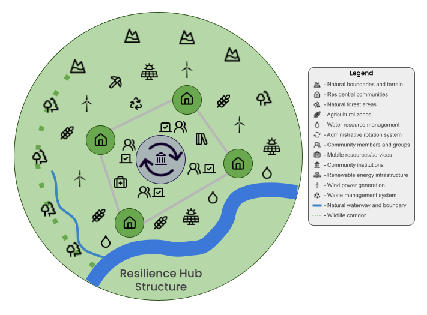

# A Blueprint for Collaborative Stewardship: A Post-Scarcity Societal Model

***
Dan Broadway
Kemattia LLC
December 2024
***

## Abstract

This whitepaper presents a comprehensive framework for a society built on collaborative stewardship, drawing inspiration from successful examples like the Mondragón Cooperative Corporation, the Kerala participatory planning system, and Nordic social democracy, while advancing beyond their limitations through new technological capabilities and ecological design principles. Our model integrates insights from complex systems theory, ecological economics, and social psychology to address contemporary challenges of resource distribution, environmental degradation, and social inequality. Drawing from successful examples of commons-based resource management and recent advances in distributed systems technology, we propose a practical pathway toward a more equitable and sustainable future.

## 1\. Introduction

The early 21st century has brought humanity face-to-face with multiple intersecting crises: accelerating climate change, widening wealth inequality, and the rapid depletion of natural resources. Current economic models have proven inadequate to address these challenges. The pursuit of infinite growth collides with planetary boundaries, while centralized control structures struggle with innovation and responsiveness to local needs.

The Collaborative Stewardship Model (CSM) offers a different path. Building on Ostrom's work on commons governance (Ostrom, 1990\) and recent advances in distributed systems technology (Davidson et al., 2016), CSM presents a framework where communities directly manage resources through nested networks of autonomous but interconnected hubs. This approach combines the dynamism and innovation of distributed systems with the equity and sustainability focus of commons-based governance.

Recent successful experiments with similar approaches \- from the Mondragón Cooperative Corporation in Spain to the Kerala Model in India \- demonstrate the viability of alternative economic structures (Gibson-Graham, 2013). These real-world examples inform our framework while addressing their limitations through contemporary technological capabilities and ecological design principles.

## 2\. Core Principles

### 2.1 Decentralized Autonomy

The foundation of CSM rests on networks of semi-autonomous Resilience Hubs. Unlike the rigid hierarchies of traditional governance systems, these hubs operate through dynamic, overlapping spheres of influence. 

|  |
|:--:|
| *Figure 1: Scales of Coordination in the CSM. The system handles most decisions at the lowest effective level, with broader coordination required only for issues affecting larger geographic areas or requiring system-wide alignment. Examples show characteristic activities at each scale, from local urgent care to global climate initiatives.* |

Each hub maintains significant autonomy in local decision-making while participating in larger coordinating structures for issues that transcend local boundaries.

Research in complex adaptive systems demonstrates that such distributed networks often outperform centralized systems in resilience and adaptability (Meadows, 2008). When one component faces challenges, the network can quickly reorganize to maintain essential functions. This principle appears throughout nature, from neural networks to mycorrhizal fungi, and provides a time-tested template for human organization.

The hub structure allows for cultural and methodological diversity, enabling communities to adapt practices to local conditions while maintaining coherent coordination at larger scales. This addresses a key weakness of previous alternative economic models: the tension between local autonomy and larger-scale coordination.

### 2.2 Resource Stewardship

The model reimagines humanity's relationship with natural resources. Rather than treating resources as commodities to be owned and exploited, CSM implements a stewardship approach grounded in indigenous wisdom and modern ecological science. Resources are held in trust for current and future generations, with access governed by sustainable use rather than accumulation.

Studies of traditional commons management systems show that communities can effectively govern shared resources when proper institutional arrangements exist (Ostrom, 2015). The CSM builds on these insights while incorporating modern monitoring technologies and scientific understanding of ecological systems.

### 2.3 Collaborative Economics

The CSM introduces a novel economic architecture built on collaborative principles. Drawing from emerging patterns of peer-to-peer production and commons-based resource management, this approach enables effective resource distribution while fostering innovation and community engagement. This approach has already demonstrated remarkable success in areas like open-source software development, where complex products emerge through voluntary cooperation rather than hierarchical control (Weber, 2004).

The system distinguishes between different types of goods and services, applying varied distribution mechanisms based on their characteristics. Basic necessities follow a universal access model, while discretionary resources operate through contribution-based systems. This hybrid approach maintains incentives for innovation while ensuring fundamental human needs are met.

Modern technologies enable unprecedented coordination capabilities. Distributed ledger systems provide transparency and accountability, while AI-driven optimization tools help match resources to needs efficiently. These technologies don't determine the system's structure but rather facilitate human-scale cooperation at previously impossible scales.

## 3\. Organizational Structure

|  |
|:--:|
| *Figure 2: Organizational Structure of the Collaborative Stewardship Model showing the nested relationships between Resilience Hubs, Regional Networks, and Global Coordination.* |

### 3.1 Resilience Hubs

Resilience Hubs form the foundational units of social organization in the CSM. These hubs typically encompass populations between 5,000 and 50,000 people, a scale determined by research in human social networks and community decision-making capacity (Dunbar, 2020). This size allows for meaningful participatory democracy while maintaining sufficient diversity and economic capacity.

|  |
|:--:|
| *Figure 3: Resilience Hub Structure depicting a community of 5,000-50,000 residents organized within natural bioregional boundaries. The hub integrates participatory governance (shown by the central rotation system), residential clusters, sustainable infrastructure, and ecological systems including wildlife corridors and natural water features. This decentralized structure enables local autonomy while maintaining connectivity with broader regional networks through shared resource management and administrative systems.* |

Each hub's geographic boundaries align with natural bioregional features, acknowledging the intimate connection between human communities and their local ecosystems. This approach, drawing from bioregional theory (Sale, 2019), helps ensure ecological sustainability while promoting local resource self-sufficiency.

The internal structure of hubs combines elements of direct democracy with rotating administrative roles. This prevents the emergence of entrenched power structures while maintaining operational efficiency. Regular rotation of responsibilities also builds broad civic capacity throughout the population.

### 3.2 Regional Networks

Regional Networks connect individual hubs into larger cooperative structures. These networks emerge organically based on geographic proximity, shared resources, and cultural affinity. Unlike rigid administrative boundaries in current systems, Regional Network boundaries remain fluid, allowing communities to reorganize as circumstances change.

The networks' primary functions include coordinating resource sharing, managing larger infrastructure projects, and facilitating knowledge transfer between hubs. When individual hubs face challenges beyond their capacity \- whether natural disasters, resource shortfalls, or technical problems \- Regional Networks mobilize collective resources in response.

Dispute resolution represents another key network function. Drawing from successful examples like the Iroquois Confederacy's Great Law of Peace, networks employ sophisticated consensus-building protocols that respect both individual hub autonomy and broader community needs.

### 3.3 Global Coordination

At the global scale, the CSM implements a lightweight coordination system focused on managing truly planetary concerns. Unlike current international bodies, this system lacks coercive power, instead deriving its effectiveness from robust information sharing and voluntary cooperation protocols.

Climate stability, ocean health, and other global commons receive particular attention at this level. Scientific advisory networks provide evidence-based guidance, while federated decision-making structures ensure all communities have meaningful input into policies affecting shared resources.

The global layer also maintains crucial technical standards enabling inter-hub cooperation. These range from communication protocols to resource accounting methods, though individual hubs retain flexibility in implementation details.

## 4\. Economic System

The Collaborative Stewardship Model implements an innovative economic architecture that moves beyond traditional market-based systems while ensuring efficient resource distribution and incentivizing innovation. This framework distinguishes between different types of goods and services, applying varied distribution mechanisms based on their fundamental role in society and relationship to human needs. Figure 3 illustrates this tiered approach to economic organization, which forms the foundation for the model's resource management, production systems, and distribution mechanisms.

|  |
|:--:|
| *Figure 4: Economic Framework of the Collaborative Stewardship Model. The pyramid structure represents a hierarchy of needs rather than power relations, illustrating how the economy is organized to serve human well-being. The base layer ensures universal access to basic necessities through a barrier-free distribution system. The middle layer demonstrates collective stewardship of common pool resources through sustainable management protocols. The top layer represents enhancement goods accessed through a contribution credit system that encourages innovation and cultural creation while preventing wealth accumulation. Icons represent key elements at each level, with the green gradient symbolizing the interconnected nature of all economic activities within the model.* |

### 4.1 Resource Management

The CSM implements a sophisticated resource management system that distinguishes between different types of goods and services. Basic necessities \- food, water, housing, healthcare, education \- operate under a universal access model. This ensures that no member of society faces deprivation of fundamental needs.

|  |
|:--:|
| *Figure 5: Resource Cycles in the Collaborative Stewardship Model. The three primary systems—Biomass, Energy, and Water—form an integrated network of regenerative cycles. Each system incorporates both traditional ecological practices and modern technological solutions, from regenerative agriculture to smart energy distribution. The central overlap represents the synergistic interaction between all systems, emphasizing the model's holistic approach to resource management.* |

Common pool resources, such as forests, fisheries, and shared infrastructure, are managed through stewardship protocols derived from successful commons governance systems. These protocols combine traditional ecological knowledge with modern monitoring technologies and scientific understanding.

Luxury items and non-essential goods function through a contribution credit system. Unlike traditional money, these credits cannot accumulate indefinitely and don't accrue interest, preventing the concentration of wealth that plagues current economic systems.

### 4.2 Production System

Production in the CSM combines high-tech automation with artisanal craftsmanship. Local manufacturing hubs, equipped with advanced fabrication technologies, produce most everyday items. These facilities emphasize modular design, repairability, and cradle-to-cradle material flows.

Open-source technology and design principles drive rapid innovation while preventing the emergence of technological monopolies. When one hub develops improvements in production methods or design, these advances quickly spread through knowledge-sharing networks to benefit all communities.

The system particularly emphasizes durability and repairability. Products are designed for long life cycles, with easily replaceable components and clear documentation. This approach drastically reduces resource consumption while creating meaningful work in maintenance and upgrade services.

### 4.3 Distribution Mechanisms

The CSM employs a multi-layered distribution system built on responsive, distributed networks. At its foundation lies an AI-augmented needs assessment system that continuously monitors and predicts resource requirements across communities. This system operates bottom-up, aggregating local data into regional and global patterns while maintaining community autonomy (Brown & Lauder, 2021).

Automated basic needs fulfillment forms the first distribution layer. Essential goods flow through a logistics network optimized for efficiency and resilience rather than profit. Local production takes precedence when possible, with regional and global exchange providing backup and specialization opportunities.

For non-essential goods, peer-to-peer sharing networks enable direct exchange between individuals and communities. These networks build on the success of platforms like library systems and tool-sharing cooperatives, but with expanded scope and technological sophistication. Studies of existing sharing networks demonstrate their ability to dramatically reduce resource consumption while improving access to goods (Sundararajan, 2019).

## 5\. Governance

### 5.1 Local Governance

Hub-level governance combines elements of direct democracy with sophisticated delegation systems. Regular community assemblies make major decisions, while working groups handle day-to-day operations. Digital platforms enable broad participation while preventing the tyranny of endless meetings that plagued some earlier democratic experiments.

The rotation of administrative roles serves multiple purposes. Beyond preventing power concentration, it builds widespread civic capacity and shared understanding of community systems. Research in cooperative governance shows this approach creates more resilient and adaptive organizations (Rothschild & Whitt, 2018).

Transparent resource allocation stands as a cornerstone of local governance. All community members can access real-time data about resource flows and usage patterns. This transparency, combined with participatory budgeting processes, ensures collective resources serve genuine community needs.

### 5.2 Inter-Hub Coordination

Regional coordination occurs through a network of overlapping councils and working groups. Unlike hierarchical structures, this system allows for flexible collaboration based on actual needs and affinities. Digital democracy platforms enable asynchronous deliberation and decision-making, overcoming traditional limitations of distance and scheduling.

Conflict resolution mechanisms draw from both indigenous wisdom and modern mediation techniques. The system emphasizes restoration and problem-solving rather than punishment or coercion. When conflicts arise between hubs, neutral mediators from other regions help facilitate solutions acceptable to all parties.

Resource sharing agreements between hubs use smart contracts and distributed ledger technology to ensure transparency and fairness. These agreements adapt automatically to changing conditions while maintaining clear accountability for all participants.

### 5.3 Global Governance

Global coordination emerges through a federation of regional networks rather than a top-down authority. This structure mirrors successful examples like the Internet Engineering Task Force, where technical standards emerge through consensus rather than mandate (Mueller, 2020).

Scientific advisory networks play a key role in global governance, particularly regarding environmental issues. Unlike current arrangements where scientific input often gets filtered through political interests, the CSM creates direct channels between researchers and decision-making processes.

Emergency response systems at the global level coordinate responses to disasters, pandemics, and other large-scale challenges. These systems build on successful examples like the International Red Cross but with enhanced technological capabilities and more direct community involvement.

## 6\. Social Systems

### 6.1 Education

The CSM reimagines education as a lifelong process integrated into daily life rather than confined to specific institutions or life stages. Learning hubs combine physical and digital resources, enabling access to both practical skills training and theoretical knowledge.

Mentorship networks connect learners with experienced practitioners across communities. This system recognizes that different people learn differently and at different paces. AI-assisted matching helps learners find mentors aligned with their interests and learning styles.

The curriculum emphasizes systems thinking, ecological understanding, and practical skills alongside traditional academic subjects. Research shows this integrated approach produces better outcomes than narrow academic or vocational focuses (Robinson & Aronica, 2016).

### 6.2 Healthcare

Healthcare in the CSM combines universal access with a strong emphasis on prevention and holistic health. Local health centers provide primary care while specialized regional facilities handle more complex cases. AI-assisted diagnostics enhance healthcare providers' capabilities while reducing costs.

The integration of traditional healing practices with modern medicine acknowledges the value of diverse medical traditions. Research demonstrates that this combined approach often produces better outcomes than either system alone (Prasad & Tyagi, 2022).

Mental health receives equal priority with physical health. Community support systems, regular social connection, and meaningful work opportunities address many factors that contribute to mental health challenges in current societies.

## 7\. Environmental Integration

### 7.1 Ecological Design

The CSM embeds ecological principles into every aspect of social design. Rather than treating environmental concerns as external factors to be mitigated, the system builds from the understanding that human communities exist within, not apart from, ecological systems. This approach draws from both indigenous wisdom and modern ecological science (Wahl, 2016).

Zero waste design principles guide all production and consumption processes. Products are designed for complete recyclability, with materials flowing in closed loops rather than linear paths from extraction to waste. Research demonstrates that such circular design can reduce resource consumption by up to 90% while maintaining or improving quality of life (Webster, 2017).

Carbon negativity moves beyond mere carbon neutrality. Each hub implements multiple strategies for carbon sequestration, from regenerative agriculture to enhanced mineral weathering. These approaches combine to gradually reduce atmospheric carbon levels while building soil fertility and enhancing ecosystem health.

Biodiversity enhancement represents another core design principle. Urban areas incorporate wildlife corridors and diverse habitats, while agricultural zones maintain genetic diversity through seed banking and polyculture farming. Studies show this integrated approach increases both ecosystem resilience and agricultural productivity.

### 7.2 Resource Cycles

Natural resource management in the CSM mirrors natural ecological cycles. Water systems, for example, maintain the integrity of local watersheds while ensuring clean water access for all community members. Innovative technologies like atmospheric water harvesting complement traditional conservation practices.

Regenerative agriculture forms the backbone of the food system. Drawing from permaculture principles and indigenous farming practices, these methods build soil fertility while producing abundant food. Research shows regenerative practices can sequester carbon while increasing yields and reducing water usage (Rodale Institute, 2020).

Energy systems emphasize both efficiency and clean production. Each hub develops a diverse portfolio of renewable energy sources suited to local conditions. Advanced storage technologies and smart grid systems ensure reliable power despite the intermittent nature of many renewable sources.

## 8\. Implementation Strategy

### 8.1 Transition Phases

The transition to a CSM society follows a carefully planned yet adaptable pathway. The first phase (Years 1-5) focuses on establishing pilot communities that demonstrate the model's viability. These communities serve as learning laboratories, developing and testing key technologies and social practices.

|  |
|:--:|
| *Figure 6: Implementation Phases of the Collaborative Stewardship Model. The transition from isolated pilot communities to a globally integrated network occurs over three phases: establishment of independent pilot communities (Years 0-5), development of regional networks and knowledge sharing (Years 5-10), and full global integration while maintaining local autonomy (Years 10-20). Green circles represent individual communities, connecting lines show resource and knowledge sharing pathways, and larger blue circles indicate regional coordination networks.* |

During the second phase (Years 5-10), successful practices spread through regional networks. This phase emphasizes scaling solutions while maintaining their effectiveness. Research on successful scaling of social innovations guides this process (Westley et al., 2019).

The final phase (Years 10-20) involves global integration of the model. This doesn't mean homogenization \- rather, it creates coherent protocols for interaction while maintaining local diversity. The Internet's development provides useful lessons for this type of coordinated yet decentralized growth.

### 8.2 Technology Requirements

The CSM requires sophisticated technological infrastructure, but much of it already exists or is in advanced development. Distributed ledger systems provide transparent resource tracking. AI optimization tools help match resources to needs. Clean energy technologies enable sustainable power generation.

|  |
|:--:|
| *Figure 7: CSM Technology Stack showing the three integrated layers of infrastructure enabling the Collaborative Stewardship Model. The Physical Infrastructure Layer provides the foundational hardware and facilities. The Data Processing Layer manages information flows and resource optimization. The Community Interface Layer enables participatory decision-making and resource management through user-facing tools and platforms. Vertical connections illustrate data flows and system integration points between layers.* |

Digital democracy platforms facilitate participatory decision-making at scale. These systems build on existing technologies while adding features for consensus-building and conflict resolution. Research in collective intelligence systems informs their design (Malone & Bernstein, 2022).

### 8.3 Social Adaptation

Beyond technical systems, successful implementation requires significant social adaptation. Community education programs help people understand and engage with new social structures. Leadership development ensures a steady supply of capable coordinators for various social functions.

Cultural integration receives particular attention. Rather than imposing a single model, the CSM encourages communities to adapt its principles to local cultural contexts. This approach has proven more successful than top-down implementation in various social change initiatives.

## 9\. Metrics and Evaluation

### 9.1 Success Indicators

The CSM employs a sophisticated system of metrics that goes beyond traditional economic indicators. These metrics track multiple dimensions of social and ecological health.

|  |
|:--:|
| *Figure 8: System Dynamics of the Collaborative Stewardship Model. This diagram illustrates the key interactions between core metrics in the CSM system. Green arrows indicate positive relationships, red arrows indicate negative relationships, and purple arrows show complex bidirectional interactions. Resources and Environmental Health form a central complex relationship, while Population exerts negative pressure on Resources. Happiness and Social Cohesion create positive feedback loops that strengthen sustainability practices. The system demonstrates both resilience through multiple feedback paths and constraints through resource limitations and environmental carrying capacity.* |

Resource sustainability measures both stock levels and regeneration rates. Unlike GDP, which treats resource depletion as positive growth, these metrics account for long-term availability and ecosystem health.

Population wellbeing encompasses physical health, mental health, social connection, and personal development opportunities. Research shows these factors better predict life satisfaction than monetary measures (Helliwell et al., 2023).

Environmental health indicators track ecosystem diversity, stability, and regenerative capacity. These measures provide early warning of environmental stress while highlighting successful restoration efforts.

### 9.2 Monitoring Systems

Real-time data collection enables rapid response to emerging challenges. Sensor networks monitor environmental conditions, while social surveys track community wellbeing. Privacy-preserving protocols ensure this monitoring doesn't become surveillance.

Transparent reporting makes all non-personal data accessible to community members. This transparency enables informed participation in decision-making while building trust in social systems.

## 10\. Challenges and Solutions

### 10.1 Transition Challenges

The shift to a CSM society faces several significant challenges. Resource redistribution often encounters resistance from those benefiting from current arrangements. Cultural adaptation takes time and effort. Technology development requires substantial investment.

However, research on social transitions suggests these challenges can be overcome through careful planning and persistent effort. Historical examples of major social transformations provide useful lessons for managing change processes.

### 10.2 Operational Challenges

Once established, the CSM must address ongoing operational challenges. Coordination complexity increases with scale. Resource optimization requires continuous adjustment. Conflict resolution demands skill and patience.

Solutions emerge through adaptive management approaches. Regular evaluation and adjustment of practices ensures the system remains responsive to changing conditions. Strong feedback loops help identify and address problems before they become severe.

### 10.3 Solutions Framework

The CSM's solutions framework emphasizes adaptability and learning. Rather than prescribing fixed solutions, it provides principles and processes for developing context-appropriate responses to challenges.

This approach combines systematic analysis with practical experimentation. Solutions develop through iterative testing and refinement, with successful approaches sharing through hub networks.

## 11\. Conclusion

The Collaborative Stewardship Model offers a viable pathway beyond current socioeconomic systems. By integrating ecological wisdom with technological innovation and social cooperation, it addresses contemporary challenges while creating conditions for sustainable human flourishing.

Success requires sustained effort and careful attention to both technical and social dimensions of change. However, the model's flexibility and grounding in human-scale relationships make it more achievable than it might initially appear.

As global challenges intensify, the need for alternative social models grows more pressing. The CSM provides a practical framework for creating a more equitable, sustainable, and fulfilling human society.

# Works Cited

Brown, P., & Lauder, H. (2021). The Death of Human Capital?: Its Failed Promise and How to Renew It in an Age of Disruption. Oxford University Press.

Davidson, S., De Filippi, P., & Potts, J. (2016). Economics of Blockchain. SSRN Electronic Journal.

Dunbar, R. (2020). Friends: Understanding the Power of our Most Important Relationships. Little, Brown and Company.

Gibson-Graham, J.K. (2013). Take Back the Economy: An Ethical Guide for Transforming Our Communities. University of Minnesota Press.

Helliwell, J., Layard, R., & Sachs, J. (2023). World Happiness Report 2023\. Sustainable Development Solutions Network.

Malone, T.W., & Bernstein, M.S. (2022). Handbook of Collective Intelligence. MIT Press.

Meadows, D. (2008). Thinking in Systems: A Primer. Chelsea Green Publishing.

Mueller, M. (2020). Networks and States: The Global Politics of Internet Governance. MIT Press.

Ostrom, E. (1990). Governing the Commons: The Evolution of Institutions for Collective Action. Cambridge University Press.

Ostrom, E. (2015). Governing the Commons: The Evolution of Institutions for Collective Action. Cambridge University Press.

Prasad, R., & Tyagi, A. (2022). Traditional Medicine in Modern Healthcare. Springer.

Robinson, K., & Aronica, L. (2016). Creative Schools: The Grassroots Revolution That's Transforming Education. Penguin Books.

Rodale Institute. (2020). Regenerative Agriculture and Climate Change. Rodale Institute.

Rothschild, J., & Whitt, J.A. (2018). The Cooperative Workplace: Potentials and Dilemmas of Organisational Democracy and Participation. Cambridge University Press.

Sale, K. (2019). Human Scale Revisited: A New Look at the Classic Case for a Decentralist Future. Chelsea Green Publishing.

Sundararajan, A. (2019). The Sharing Economy: The End of Employment and the Rise of Crowd-Based Capitalism. MIT Press.

Wahl, D.C. (2016). Designing Regenerative Cultures. Triarchy Press.

Weber, S. (2004). The Success of Open Source. Harvard University Press.

Webster, K. (2017). The Circular Economy: A Wealth of Flows. Ellen MacArthur Foundation.

Westley, F., McGowan, K., & Tjörnbo, O. (2019). The Evolution of Social Innovation. Edward Elgar Publishing.

