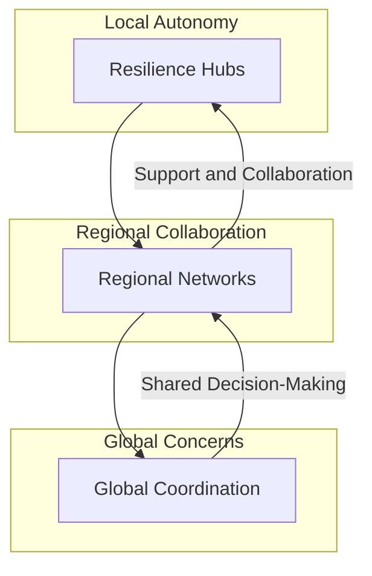

```mermaid
graph TD
    A[Resilience Hubs] --> B[Regional Networks]
    B --> C[Global Coordination]
    subgraph Local Autonomy
        A
    end
    subgraph Regional Collaboration
        B
    end
    subgraph Global Concerns
        C
    end
    C -->|Shared Decision-Making| B
    B -->|Support and Collaboration| A

```