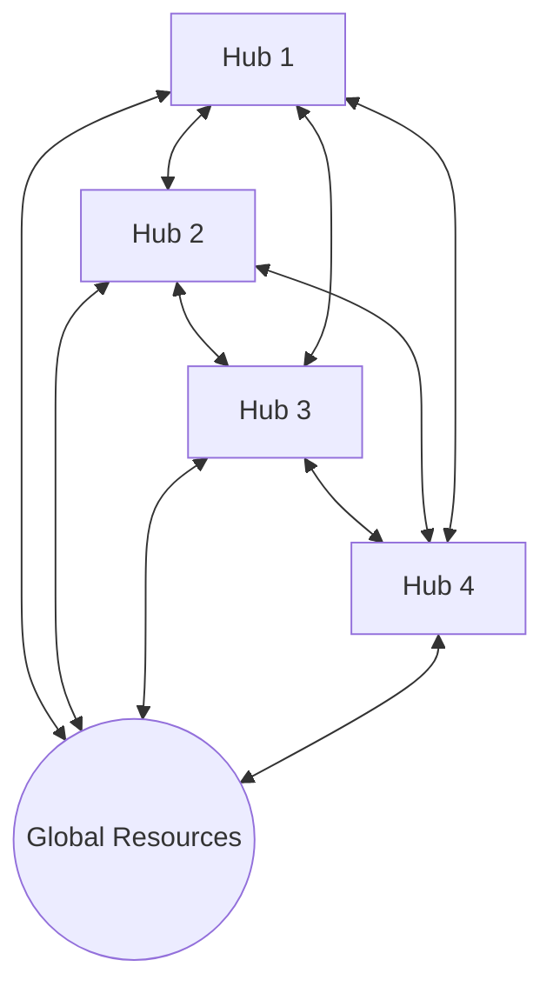
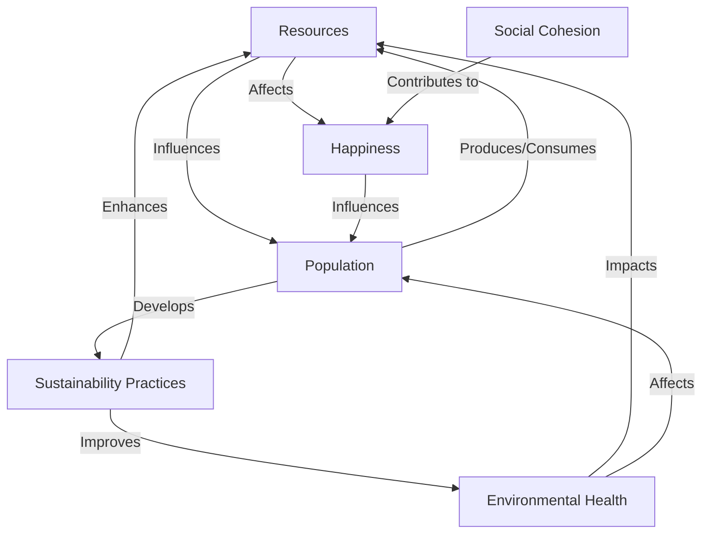

# Collaborative Stewardship Model: Detailed Explanation

## Introduction

The Collaborative Stewardship model simulates a post-capitalist society organized around principles of sustainability, cooperation, and local autonomy. It draws inspiration from concepts such as eco-villages, regenerative economics, systems thinking in sustainability, and collaborative governance models.

## Core Components

1. **Resilience Hubs**: Semi-autonomous communities that manage local resources, population, and sustainability practices.
2. **Global Resources**: A shared pool of resources that all hubs contribute to and draw from.
3. **Inter-Hub Interactions**: Direct collaborations and exchanges between hubs.

## Decentralized Structure

Unlike traditional top-down models, the Collaborative Stewardship model operates on a decentralized basis:

- There is no central controlling entity.
- Decision-making and resource management are distributed among the hubs.
- The overall system behavior emerges from individual hub actions and inter-hub collaborations.

## Key Interactions

1. **Hub-to-Hub**: 
   - Direct resource sharing
   - Knowledge and technology transfer
   - Collaborative projects

2. **Hub-to-Global Resources**:
   - Contribution to the global resource pool
   - Sustainable extraction from global resources
   - Collective responsibility for resource regeneration

3. **Emergent System Behavior**:
   - Overall sustainability practices evolve from hub interactions
   - System-wide resilience emerges from diverse hub strategies
   - Global resource health reflects collective hub actions

## Visual Representation

This diagram illustrates:
- Direct interactions between all hubs
- Shared access and responsibility for global resources
- No central controlling entity
- Equal importance of all hubs in the system

## Implications for Model Dynamics

1. **Resilience**: The decentralized structure enhances overall system resilience. If one hub struggles, others can adapt and provide support.

2. **Diversity**: Each hub can develop unique strategies, contributing to system-wide innovation and adaptability.

3. **Collaborative Learning**: Direct hub-to-hub interactions facilitate rapid spread of successful practices.

4. **Collective Responsibility**: All hubs share the responsibility for maintaining global resource health, promoting sustainable practices.

5. **Emergent Behaviors**: System-wide trends and behaviors emerge organically from the collective actions of individual hubs, rather than being dictated by a central authority.

This decentralized structure allows the model to explore how a collaborative, sustainability-focused society might function and evolve over time, driven by local decision-making and global cooperation.

## Key Metrics and Their Interactions

### 1. Resources (R)
- Produced based on population, technology level, and sustainability practices
- Consumed by population
- Affects happiness and population growth

### 2. Population (P)
- Grows or declines based on resource availability, happiness, and environmental health
- Produces and consumes resources
- Contributes to sustainability practices

### 3. Environmental Health (E)
- Affected by resource production/consumption and sustainability practices
- Influences resource regeneration and population growth

### 4. Happiness (H)
- Composite of resource availability, environmental health, and social cohesion
- Affects population growth and stability

### 5. Social Cohesion (S)
- Influenced by resource availability and random events
- Contributes to overall happiness

### 6. Sustainability Practices (SP)
- Improve over time through learning and events
- Positively impact resource production and environmental health

## Core Equations

### Resource Production

The production of resources in each hub is modeled by:

$$ R_{prod} = P \cdot T \cdot \alpha \cdot \frac{E}{100} \cdot (1 + \frac{SP}{200}) $$

Where:
- $R_{prod}$ is the resource production
- $P$ is the population
- $T$ is the technology level
- $\alpha$ is a random factor between 0.8 and 1.2
- $E$ is the environmental health
- $SP$ is the level of sustainability practices

### Population Growth

Population growth is modeled using:

$$ \Delta P = P \cdot r \cdot \frac{H}{100} \cdot f_R \cdot \frac{E}{100} \cdot (1 - |\frac{P - P_0}{P_0}|) $$

Where:
- $\Delta P$ is the change in population
- $r$ is the base growth rate (e.g., 0.005)
- $H$ is happiness
- $f_R$ is a resource factor
- $P_0$ is the initial population

### Environmental Health Change

The change in environmental health is modeled as:

$$ \Delta E = -\beta \cdot (1 - \frac{SP}{100}) + \gamma \cdot \frac{SP}{100} $$

Where:
- $\Delta E$ is the change in environmental health
- $\beta$ is the degradation factor (random between 0 and 0.2)
- $\gamma$ is the regeneration factor (random between 0 and 0.1)
- $SP$ is the level of sustainability practices

### Happiness Calculation

Happiness is a weighted average of various factors:

$$ H = 0.3R_f + 0.3E + 0.2S + 0.2SP $$

Where:
- $R_f$ is a factor based on resource availability
- $E$ is environmental health
- $S$ is social cohesion
- $SP$ is the level of sustainability practices

## Inter-Hub Interactions

### Resource Sharing

Resources are shared between hubs to balance inequalities:

$$ R_{transfer} = \min(\text{deficit}, (R_{donor} - R_{avg}) \cdot 0.2) $$

Where:
- $R_{transfer}$ is the amount of resource transferred
- deficit is the difference between a hub's resources and the average
- $R_{donor}$ is the resources of the donating hub
- $R_{avg}$ is the average resource level across all hubs

### Knowledge Transfer

Sustainability practices are shared between hubs:

$$ SP_{new} = SP + (SP_{best} - SP) \cdot 0.1 $$

Where:
- $SP_{new}$ is the updated sustainability practice level
- $SP$ is the current level
- $SP_{best}$ is the highest level among all hubs

## Global Resource Dynamics

Global resources regenerate based on average environmental health and sustainability practices:

$$ R_{global} = R_{global} \cdot (1 + \rho \cdot \frac{E_{avg}}{100} \cdot (1 + \frac{SP_{avg}}{200})) $$

Where:
- $R_{global}$ is the global resource level
- $\rho$ is the base regeneration rate
- $E_{avg}$ is the average environmental health across all hubs
- $SP_{avg}$ is the average sustainability practice level

## Random Events

The model includes random events that can affect various metrics. The probability of an event occurring is:

$$ P(event) = 0.01 $$

Events can include natural disasters, technological breakthroughs, social movements, etc., each with specific impacts on the hub's metrics.

## Real-World Parallels

1. **Resource Management**: Similar to sustainable communities managing local resources.
2. **Population Dynamics**: Reflects how quality of life influences population movements.
3. **Environmental Impact**: Models concept of planetary boundaries and human impact on ecosystems.
4. **Social Factors**: Represents importance of community cohesion in resilient societies.
5. **Technological Progress**: Simulates efficiency improvements balanced with sustainability.
6. **Inter-community Cooperation**: Reflects principles of mutual aid and resource sharing.

## Limitations and Abstractions

- Simplifies complex ecological processes
- Assumes high degree of cooperation between communities
- Does not account for external influences
- Abstracts technological progress into a single metric

## Visual Representation of Key Interactions

This diagram illustrates the interconnected nature of the key metrics in the model, showing how each factor influences and is influenced by others, creating a complex system of feedback loops.

## Conclusion

This model provides a framework for exploring the dynamics of a collaborative, sustainability-focused society. By adjusting parameters and observing outcomes, users can explore different scenarios and hypotheses about how such a society might function and evolve over time.
